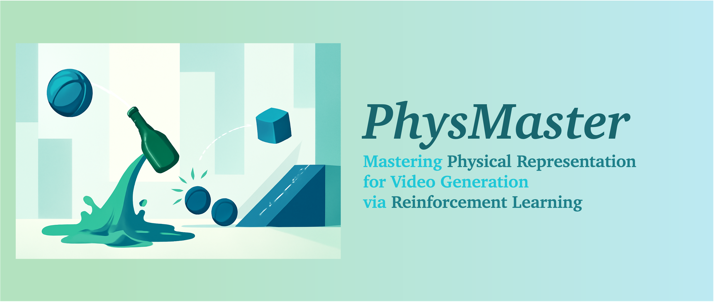

<p align="center" >
    
</p>

<!-- # <div align="center" >PhysMaster : Mastering Physical Representation for Video Generation via Reinforcement Learning<div align="center"> -->
---
<!-- ###  <div align="center"> SIGGRAPH Asia 2025 </div> -->
<p align="center">
  <a href='https://sihuiji.github.io/PhysMaster-Page/'></a>
  &nbsp;
  <a href="https://arxiv.org/abs/2506.03140"></a>
  &nbsp;
  <!-- <a href='https://huggingface.co/datasets/KwaiVGI/CameraClone-Dataset'></a> -->
</p>
<div align="center">
  <p>
    <a href="https://sihuiji.github.io/">Sihui Ji</a><sup>1</sup>
    <a href="https://xavierchen34.github.io/">Xi Chen</a><sup>1</sup>
    <a href="https://www.xtao.website/">Xin Tao</a><sup>2</sup>
    <a href="https://magicwpf.github.io/">Pengfei Wan</a><sup>2</sup>
    <a href="https://hszhao.github.io/"> Hengshuang Zhao</a><sup>1✉</sup>
  </p>
  <p>
    <sup>1</sup>The University of Hong Kong &nbsp;&nbsp;
    <sup>2</sup>Kling Team, Kuaishou Technology<br>
    <sup>✉</sup>Corresponding author
  </p>
</div>

<!-- **Note:** This open-source repository is intended to provide a reference implementation. Due to the difference in the underlying I2V model's performance, the open-source version may not achieve the same performance as the model in our paper.  -->

## &#x1F4CC; Updates
<!-- - __[2025.10.09]__: Training and Inference Code, [Model Checkpoints](https://huggingface.co/KwaiVGI/CamCloneMaster-Wan2.1) are available.
- __[2025.09.25]__: [CamCloneMaster](https://arxiv.org/abs/2506.03140) has been accepted by SIGGRAPH Aisa 2025.
- __[2025.09.08]__: [CameraClone Dataset](https://huggingface.co/datasets/KwaiVGI/CameraClone-Dataset/) is avaliable. -->
- __[2025.10.16]__: Release the [Project Page](https://sihuiji.github.io/PhysMaster-Page/) and the [Arxiv]() version.

## 📷 Introduction
**TL;DR:** We propose PhysMaster, which captures physical knowledge as a representation for guiding video generation models to enhance their physics-awareness. Specifically, PhysMaster is based on the image-to-video task where the model is expected to
predict physically plausible dynamics from the input image. We devise PhysEncoder to encode such physical representation
as an extra condition, and adopt a top-down optimization strategy for finetuning PhysEncoder based on the physical plausibility of the final generated videos using reinforcement learning (RL). Experiment results demonstrate strong performance of our model on both specialized proxy tasks and general open-world scenarios.
<table align="center">
<tr>
<td>
    
</td>
</tr>
</table>

## &#x1F304; Gallery
### Comparisons with Previous Works

<table class="center">
<tr>
    <td width=98% style="border: none">
        <video controls loop src="https://github.com/SihuiJi/PhysMaster/blob/main/assets/compare.mp4" muted="false"></video>
    </td>
</tr>
</table>

### Ablation Analysis

<table class="center">
<tr>
    <td width=98% style="border: none">
        <video controls loop src="https://github.com/SihuiJi/PhysMaster/blob/main/assets/ablation.mp4" muted="false"></video>
    </td>
</tr>
</table>

## &#x2696; License
This repository is released under the Apache-2.0 license as found in the [LICENSE](LICENSE) file.

## &#x1F4DA; Citation
If you find this codebase useful for your research, please use the following entry.
```BibTeX
@article{Ji2025physmaster,
  title={{PhysMaster: Mastering Physical Representation for Video Generation via Reinforcement Learning}},
  author={Ji, Sihui and Chen, Xi and Tao, Xin and Wan, Pengfei and Zhao, Hengshuang},
  journal={arXiv preprint arXiv:xxxx.xxxxx},
  year={2025}
}
```