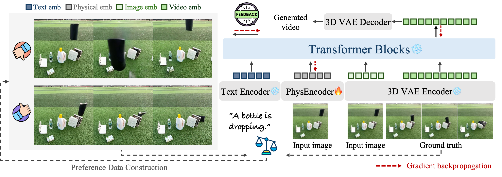

# PhysMaster
PhysMaster : Mastering Physical Representation for Video Generation via Reinforcement Learning
[Sihui Ji](https://sihuiji.github.io/Homepage/), [Xi Chen](https://xavierchen34.github.io/), [Xin Tao](https://www.xtao.website/), [Pengfei Wan](https://scholar.google.com/citations?user=P6MraaYAAAAJ&hl=en), [Kun Gai](https://openreview.net/profile?id=~Kun_Gai1), [Hengshuang Zhao](https://hszhao.github.io/)

<a href='https://sihuiji.github.io/PhysMaster-Page/'></a> <a href=''>



## Citation

```
```